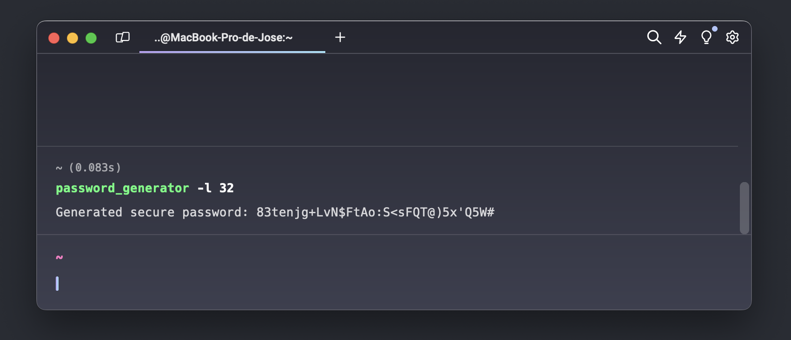

# Secure Password Generator

This project provides a simple and secure tool to generate passwords using Python. The script generates passwords with a user-specified length, including lowercase letters, uppercase letters, digits and punctuation characters to ensure strong passwords.




## Features

- Generate secure passwords with a custom length.
- Includes at least one lowercase letter, one uppercase letter, one digit and one punctuation character.
- Easy to use from the command line.

## Requirements

- Python 3.6 or higher.
- `pytest` to run unit tests (optional).

## Installation

1. Clone the repository:

```bash
git clone https://github.com/jgonzalez-89/python_password.git
cd python_password
```

Make the script executable:

```bash
chmod +x generate_password.py
```

(Optional) Move the script to a directory in your PATH:

```bash
sudo mv generate_password.py /usr/local/bin/generate_password
```

Make sure /usr/local/bin is in your PATH:

```bash
echo $PATH
```

If /usr/local/bin is not in your PATH, add the following line to your ~/.bashrc or ~/.zshrc file:

```bash
export PATH=$PATH:/usr/local/bin
```

Then, reload the shell configuration file:

```bash
source ~/.bashrc  # o source ~/.zshrc
```

## Use
To generate a password from the command line, use:

```bash
generate_password -l 16  # To generate a 16-character password
```

Or simply:

```bash
generate_password  # To generate a 32-character password (default)
```

## Tests

To run unit tests, make sure you have pytest installed and run it:

```bash
pytest test_password_generator.py
```


## Contribution

Contributions are welcome. Please open an issue or pull request to discuss any changes you wish to make.

## License
This project is licensed under the MIT License. See the LICENSE file for more details.